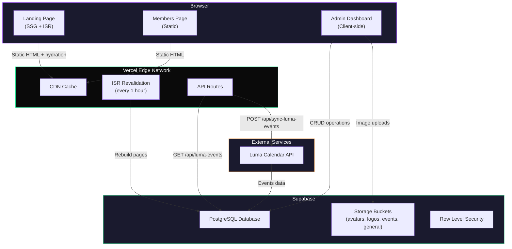
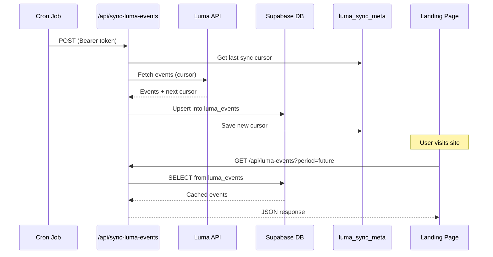

# Superteam Malaysia

The official website for **Superteam Malaysia** — the home for Solana builders in Malaysia.

Built for the [Superteam Malaysia Website Design & Build Challenge](https://superteam.fun/earn/listing/superteam-malaysia-website-design-and-build-challenge) on Superteam Earn.

> Live Demo: [https://superteammy-three.vercel.app](https://superteammy-three.vercel.app)

---

## Project Overview

A full-featured community website with a public-facing landing page and a comprehensive admin dashboard (CMS). The landing page showcases Superteam Malaysia's mission, members, events, partners, and opportunities in the Solana ecosystem. The admin dashboard allows non-technical administrators to manage all website content without touching code.

### Key Highlights

- **9-section landing page** — Hero (with video backgrounds), Mission, Stats, Events, Member Spotlight, Partners, Wall of Love, FAQ, Join CTA
- **Members directory** — searchable, filterable by skill, with animated card interactions
- **Full CMS admin dashboard** — manage every piece of content from a single interface
- **Luma calendar integration** — live event data with dual-layer caching
- **ISR (Incremental Static Regeneration)** — pages revalidate every hour for fresh content without rebuilds
- **Fully responsive** — optimized for mobile, tablet, and desktop
- **Dark theme** — custom design tokens aligned with Superteam/Solana brand identity

---

## Tech Stack

| Category | Technology |
|---|---|
| **Framework** | [Next.js 16](https://nextjs.org) (Pages Router, TypeScript) |
| **Styling** | [Tailwind CSS v4](https://tailwindcss.com) |
| **Database & Storage** | [Supabase](https://supabase.com) (PostgreSQL, Storage, RLS) |
| **Animations** | [Framer Motion](https://www.framer.com/motion/) |
| **Icons** | [Lucide React](https://lucide.dev) |
| **Twitter Embeds** | [React Tweet](https://github.com/vercel/react-tweet) |
| **Image Cropping** | [React Easy Crop](https://github.com/ValentinH/react-easy-crop) |
| **Markdown** | [Marked](https://marked.js.org/) |
| **Notifications** | [React Hot Toast](https://react-hot-toast.com/) |
| **Date Utilities** | [date-fns](https://date-fns.org/) |

---

## Features

### Landing Page (`/`)

| Section | Description |
|---|---|
| **Hero** | Bold headline with interactive video backgrounds (Solana/Malaysia toggle), animated cursor on hover, partner logo marquee bar |
| **Mission** | Key pillars — builder support, events, grants, jobs, education, ecosystem connections. Each pillar has an editable image and link |
| **Stats / Impact** | Animated counters for members, events hosted, projects built, bounties completed, community reach |
| **Events** | Live integration with [Luma](https://luma.com) — upcoming/past tabs, infinite scroll, timeline UI with date grouping |
| **Member Spotlight** | Interactive pixel grid with Solana logo shape, clickable member avatars, animated detail cards with skills and social links |
| **Partners / Ecosystem** | Infinite-scroll marquee of partner logos on purple bar (white-filtered), each linking to partner website |
| **Wall of Love** | Embedded tweets via React Tweet + testimonial cards in masonry layout |
| **FAQ** | Accordion with 3 categories (General, Events, Opportunities), each with editable category image |
| **Join CTA** | Call-to-action linking to Telegram and Twitter/X |

### Members Page (`/members`)

- Full member directory with search
- Skill-based filters: Core Team, Rust, Frontend, Design, Content, Growth, Product, Community, DeFi, NFTs, Backend
- Animated card flip interactions with role-based color gradients
- Twitter/X links, skill badges, and bio (supports Markdown for achievements)

### Admin Dashboard (`/admin`)

| Page | Manages |
|---|---|
| **Dashboard** | Overview stats (members, events, partners, testimonials), Hero section content, Join CTA content |
| **Announcements** | Published announcement banners |
| **Partners** | Partner logos (with background remover, zoom/scale editor), website links |
| **Events** | Event listings, section title/description |
| **Mission** | Mission pillars with images and links, section title/description |
| **Results** | Stats JSON editor, section title/description |
| **Community** | Community project icons (3x3 grid), member profiles with spotlight toggle, section title/description |
| **Wall of Love** | Testimonials (tweet embeds or manual quotes), section title/description |
| **FAQ** | FAQ items by category, category images |

---

## Installation

### Prerequisites

- **Node.js 18+** (recommended: Node.js 20)
- **npm** (comes with Node.js)
- A [Supabase](https://supabase.com) account (free tier works)

### 1. Clone the Repository

```bash
git clone https://github.com/JingYuan0926/website.git
cd website
```

### 2. Install Dependencies

```bash
npm install
```

### 3. Set Up Environment Variables

Create a `.env.local` file in the project root:

```env
# Supabase Configuration (required)
NEXT_PUBLIC_SUPABASE_URL=https://your-project-id.supabase.co
NEXT_PUBLIC_SUPABASE_ANON_KEY=your-supabase-anon-key
SUPABASE_SERVICE_ROLE_KEY=your-supabase-service-role-key

# Site URL (required)
NEXT_PUBLIC_SITE_URL=http://localhost:3000

# Luma Sync Protection (optional)
SYNC_SECRET=your-random-secret-string
```

**Where to find your Supabase keys:**
1. Go to your [Supabase Dashboard](https://supabase.com/dashboard)
2. Select your project
3. Go to **Settings** > **API**
4. Copy the **Project URL**, **anon/public key**, and **service_role key**

| Variable | Required | Description |
|---|---|---|
| `NEXT_PUBLIC_SUPABASE_URL` | Yes | Your Supabase project URL (e.g. `https://abcdefg.supabase.co`) |
| `NEXT_PUBLIC_SUPABASE_ANON_KEY` | Yes | Supabase anonymous/public API key — safe to expose client-side |
| `SUPABASE_SERVICE_ROLE_KEY` | Yes | Supabase service role key — server-side only, never expose to client |
| `NEXT_PUBLIC_SITE_URL` | Yes | Your site URL (`http://localhost:3000` for local, your domain for production) |
| `SYNC_SECRET` | No | Bearer token to protect the `/api/sync-luma-events` endpoint |

### 4. Set Up Supabase Database

1. Create a new project at [supabase.com](https://supabase.com)
2. Go to **SQL Editor** in your Supabase dashboard
3. Run each migration file **in order** by copying and pasting the contents:

```
supabase/migrations/000_luma_events.sql        → Luma events cache + sync metadata tables
supabase/migrations/001_initial_schema.sql      → Core schema (members, events, partners, testimonials, FAQ, stats, profiles) + RLS policies + seed data
supabase/migrations/002_cms_enhancements.sql    → CMS tables (announcements, site_content, mission_pillars) + storage buckets
supabase/migrations/003_mission_faq_images.sql  → Image support for mission pillars and FAQ
supabase/migrations/004_community_projects.sql  → Community projects table for ecosystem grid
```

4. **Create storage buckets** (if not created by migrations):
   - Go to **Storage** in your Supabase dashboard
   - Create 4 **public** buckets: `avatars`, `logos`, `events`, `general`
   - For each bucket, go to **Policies** and add a policy allowing public read access

### 5. Start Development Server

```bash
npm run dev
```

Open [http://localhost:3000](http://localhost:3000) to view the site.

---

## Local Development Guide

### Available Scripts

| Command | Description |
|---|---|
| `npm install` | Install all dependencies |
| `npm run dev` | Start development server with Turbopack (hot reload) |
| `npm run build` | Build for production |
| `npm run start` | Start production server locally |
| `npm run lint` | Run ESLint to check code quality |

### Accessing the Admin Dashboard

1. Navigate to [http://localhost:3000/admin](http://localhost:3000/admin)
2. Log in with the demo credentials:
   - **Email:** `stmy@gmail.com`
   - **Password:** `12345`

From the admin dashboard you can:
- Add/edit/delete **members**, **events**, **partners**, **testimonials**, **FAQ items**, **announcements**, **mission pillars**, and **community projects**
- Edit all **landing page text, images, and links** inline per section
- Upload images with drag-and-drop, URL paste, cropping, and background removal
- Manage **partner logos** with zoom/scale controls and purple background preview

### Luma Events Sync

Events are fetched from the [Luma](https://luma.com) calendar API and cached in Supabase for fast loading.

- **Automatic**: The landing page fetches cached events from `/api/luma-events`
- **Manual sync**: Send a POST request to `/api/sync-luma-events` with the `SYNC_SECRET` bearer token:

```bash
curl -X POST https://your-site.com/api/sync-luma-events \
  -H "Authorization: Bearer your-sync-secret"
```

You can set up a cron job (e.g. via Vercel Cron, GitHub Actions, or cron-job.org) to sync events periodically.

---

## Database Schema

### Supabase Tables

| Table | Purpose |
|---|---|
| `members` | Community member profiles — name, title, bio (Markdown), avatar, skills, social links, spotlight flag |
| `events` | Manually created events |
| `luma_events` | Cached events from Luma API (future and past) |
| `luma_sync_meta` | Sync cursor and timestamp for incremental Luma syncing |
| `partners` | Partner logos, website URLs, display order, logo scale |
| `testimonials` | Wall of Love — tweet embeds or manual quotes with author info |
| `faq_items` | FAQ accordion items with category (General/Events/Opportunities) |
| `mission_pillars` | Mission section pillars with title, description, image, and link |
| `announcements` | Banner announcements with publish status |
| `site_stats` | Landing page statistics (single JSON row) |
| `site_content` | CMS key-value store — section-scoped editable text, URLs, and images |
| `community_projects` | Ecosystem project icons for the 3x3 community grid |
| `profiles` | User roles (admin/editor) linked to Supabase Auth |

### Storage Buckets

| Bucket | Purpose |
|---|---|
| `avatars` | Member profile photos |
| `logos` | Partner logos and community project icons |
| `events` | Event cover images |
| `general` | Mission images, FAQ images, testimonial images, and other content |

All tables have **Row Level Security (RLS)** enabled:
- **Public read** — anyone can view data
- **Authenticated write** — only users with `admin` or `editor` role in the `profiles` table can create/update/delete

---

## API Routes

| Endpoint | Method | Description |
|---|---|---|
| `/api/luma-events` | GET | Fetch cached Luma events. Query params: `period` (`future`/`past`), `cursor` (pagination token) |
| `/api/sync-luma-events` | POST | Trigger background sync from Luma API. Protected by `SYNC_SECRET` bearer token |

---

## Project Structure

```
pages/
├── index.tsx                # Landing page (all 9 sections)
├── members.tsx              # Members directory with search + filters
├── api/
│   ├── luma-events.ts       # Cached Luma events endpoint
│   └── sync-luma-events.ts  # Background Luma sync worker
└── admin/                   # Admin dashboard (CMS)
    ├── index.tsx             # Dashboard overview + Hero/Join CTA editors
    ├── members.tsx           # Manage members + community projects
    ├── events.tsx            # Manage events + section content
    ├── partners.tsx          # Manage partner logos + links
    ├── testimonials.tsx      # Manage Wall of Love testimonials
    ├── faq.tsx               # Manage FAQ items + category images
    ├── announcements.tsx     # Manage announcement banners
    ├── mission.tsx           # Manage mission pillars + section content
    └── settings.tsx          # Stats editor + Results section content

components/
├── landing/                 # Landing page components
│   ├── MemberSpotlight.tsx  # Interactive pixel grid member showcase
│   ├── WallOfLove.tsx       # Testimonials with tweet embeds
│   └── JoinCTA.tsx          # Join community call-to-action
├── admin/                   # Admin dashboard components
│   ├── AdminLayout.tsx      # Sidebar navigation + logout
│   ├── AdminLogin.tsx       # Login page
│   ├── DataTable.tsx        # Reusable CRUD data table
│   ├── FormModal.tsx        # Add/edit modal with field types
│   ├── ImageUpload.tsx      # Drag-drop + crop + BG removal + URL paste
│   └── SectionContent.tsx   # Inline CMS content editor per section
├── shared/                  # Reusable components
│   ├── AnimatedSection.tsx  # Scroll-triggered animations
│   ├── SkillBadge.tsx       # Color-coded skill tags
│   └── Markdown.tsx         # Markdown renderer
├── members/                 # Members page components
│   ├── MemberCard.tsx       # Flip card with gradient
│   └── MemberFilters.tsx    # Skill filter bar
└── layout/                  # Layout components
    ├── Navbar.tsx            # Navigation bar
    └── Footer.tsx            # Site footer

lib/
├── supabase.ts              # Supabase client (browser + server)
├── adminAuth.tsx            # Admin auth context (session-based)
├── types.ts                 # TypeScript interfaces
├── constants.ts             # Config and sample/fallback data
└── utils.ts                 # Helper functions

supabase/
└── migrations/              # SQL migration files (run in order)
    ├── 000_luma_events.sql
    ├── 001_initial_schema.sql
    ├── 002_cms_enhancements.sql
    ├── 003_mission_faq_images.sql
    └── 004_community_projects.sql

public/                      # Static assets (logos, videos, images)
styles/
└── globals.css              # Tailwind config + custom theme variables
```

---

## Deployment

### Vercel (Recommended)

1. **Push code to GitHub**

```bash
git add .
git commit -m "Ready for deployment"
git push origin main
```

2. **Import project in Vercel**
   - Go to [vercel.com](https://vercel.com) and sign in with GitHub
   - Click **"Add New Project"** and select your repository

3. **Add environment variables**
   - In the Vercel project settings, go to **Settings** > **Environment Variables**
   - Add all 5 variables from your `.env.local`:

   | Name | Value |
   |---|---|
   | `NEXT_PUBLIC_SUPABASE_URL` | `https://your-project-id.supabase.co` |
   | `NEXT_PUBLIC_SUPABASE_ANON_KEY` | Your anon key |
   | `SUPABASE_SERVICE_ROLE_KEY` | Your service role key |
   | `NEXT_PUBLIC_SITE_URL` | `https://your-domain.vercel.app` |
   | `SYNC_SECRET` | Your random secret string |

4. **Deploy** — Vercel will automatically build and deploy. Every push to `main` triggers a new deployment.

### Other Platforms (Netlify, Railway, etc.)

```bash
# Build the production bundle
npm run build

# Start the production server
npm run start
```

Ensure all environment variables are configured in your hosting platform's settings.

### Post-Deployment Setup

1. **Update `NEXT_PUBLIC_SITE_URL`** to your production domain
2. **Set up Luma sync** (optional): Create a cron job to POST to `/api/sync-luma-events` every few hours to keep events fresh
3. **Access admin dashboard** at `https://your-domain.com/admin`
4. **Upload content** through the CMS — add members, partners, events, testimonials, and customize all landing page text

---

## Architecture

### System Overview



### Data Flow

```mermaid
flowchart LR
    subgraph CMS["Admin CMS"]
        E1["Edit Content"]
        E2["Upload Images"]
        E3["Manage Members"]
    end

    subgraph DB["Supabase DB"]
        T1["site_content"]
        T2["members"]
        T3["partners"]
        T4["testimonials"]
        T5["mission_pillars"]
        T6["faq_items"]
        T7["luma_events"]
        T8["community_projects"]
    end

    subgraph Build["Next.js ISR"]
        GSP["getStaticProps<br/>(revalidate: 3600)"]
    end

    subgraph Pages["Public Pages"]
        P1["Landing Page"]
        P2["Members Page"]
    end

    CMS -->|"Supabase Client"| DB
    DB -->|"Parallel queries"| GSP
    GSP -->|"Props"| Pages

    style CMS fill:#2d1b4e,stroke:#9945ff,color:#fff
    style DB fill:#1a2e1a,stroke:#3ecf8e,color:#fff
    style Build fill:#1a1a2e,stroke:#14F195,color:#fff
    style Pages fill:#0a0a0a,stroke:#fff,color:#fff
```



### Component Architecture

```mermaid
graph TD
    subgraph Pages["Pages"]
        INDEX["pages/index.tsx"]
        MEMBERS["pages/members.tsx"]
        ADMIN["pages/admin/*"]
    end

    subgraph Landing["Landing Components"]
        HERO["Hero Section<br/>(Video + HighlightWord)"]
        MARQUEE["PartnerMarquee"]
        EVENTS["EventsPane<br/>(Luma Integration)"]
        MISSION["FeaturesSection<br/>(Scroll-driven)"]
        STATS["Stats Section"]
        SPOTLIGHT["MemberSpotlight<br/>(Pixel Grid)"]
        WOL["WallOfLove<br/>(Tweet Embeds)"]
        FAQ["FAQSection<br/>(Accordion)"]
        CTA["Join CTA + Footer"]
    end

    subgraph Admin["Admin Components"]
        LAYOUT["AdminLayout<br/>(Sidebar)"]
        DT["DataTable<br/>(CRUD)"]
        FM["FormModal<br/>(Fields)"]
        IU["ImageUpload<br/>(Crop + BG Remove)"]
        SC["SectionContent<br/>(Inline Editor)"]
        AUTH["AdminAuth<br/>(Session)"]
    end

    subgraph Shared["Shared"]
        BADGE["SkillBadge"]
        ANIM["AnimatedSection"]
        MD["Markdown"]
    end

    INDEX --> HERO
    INDEX --> MARQUEE
    INDEX --> EVENTS
    INDEX --> MISSION
    INDEX --> STATS
    INDEX --> SPOTLIGHT
    INDEX --> WOL
    INDEX --> FAQ
    INDEX --> CTA

    ADMIN --> LAYOUT
    ADMIN --> DT
    ADMIN --> FM
    ADMIN --> SC
    FM --> IU
    ADMIN --> AUTH

    MEMBERS --> BADGE
    SPOTLIGHT --> BADGE

    style Pages fill:#1a1a2e,stroke:#9945ff,color:#fff
    style Landing fill:#0a0a0a,stroke:#14F195,color:#fff
    style Admin fill:#0a0a0a,stroke:#f0a050,color:#fff
    style Shared fill:#0a0a0a,stroke:#888,color:#fff
```



### Luma Events Sync Pipeline



---

## Design Decisions

- **CMS follows frontend** — all CMS fields mirror the actual landing page content. Admins edit what they see.
- **ISR over SSR** — pages are statically generated and revalidate every hour, giving fast load times with near-real-time content updates.
- **Dual-layer event caching** — Luma events are cached in Supabase (database) and served via API routes with CDN caching, avoiding direct Luma API calls on every page load.
- **Partner logo processing** — canvas-based background removal + white CSS filter ensures all logos display consistently on the purple brand bar regardless of original logo format.
- **Session-based admin auth** — lightweight demo authentication using session storage. For production, swap to Supabase Auth with the existing `profiles` table and RLS policies.

---

## License

This project was built for the Superteam Malaysia Website Design & Build Challenge.
